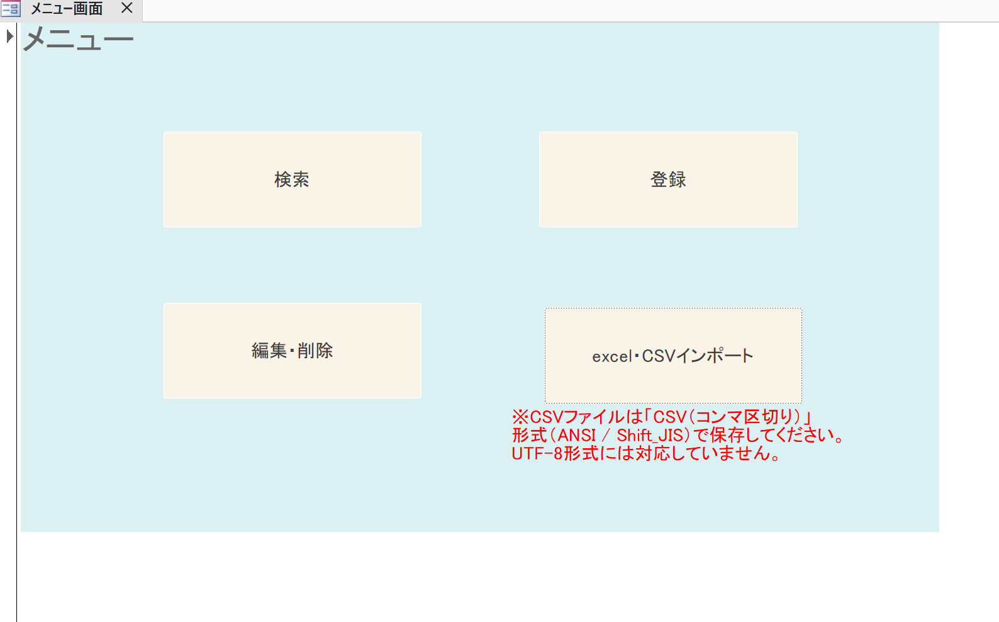
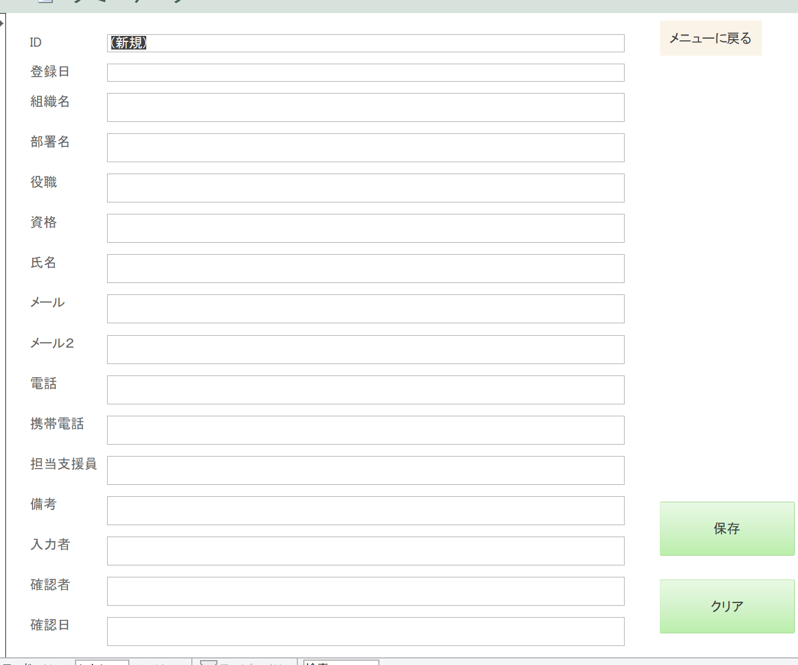
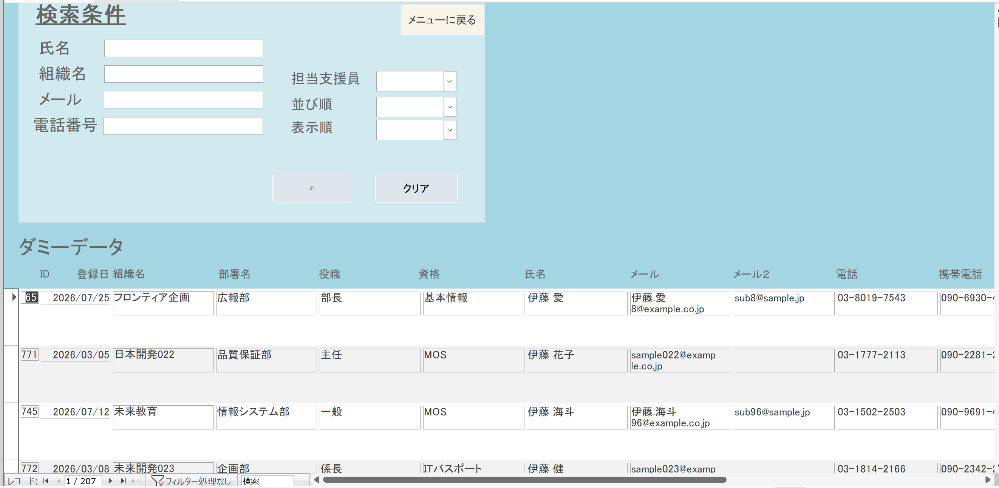
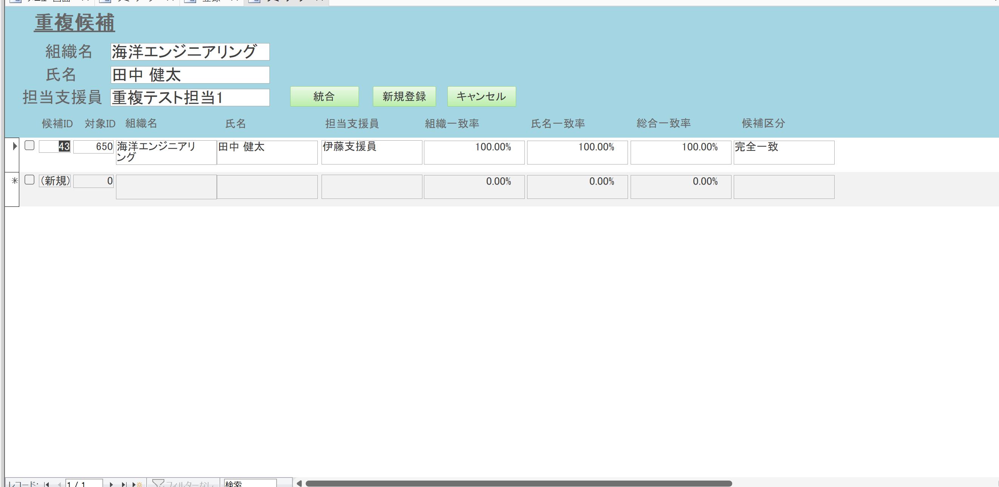
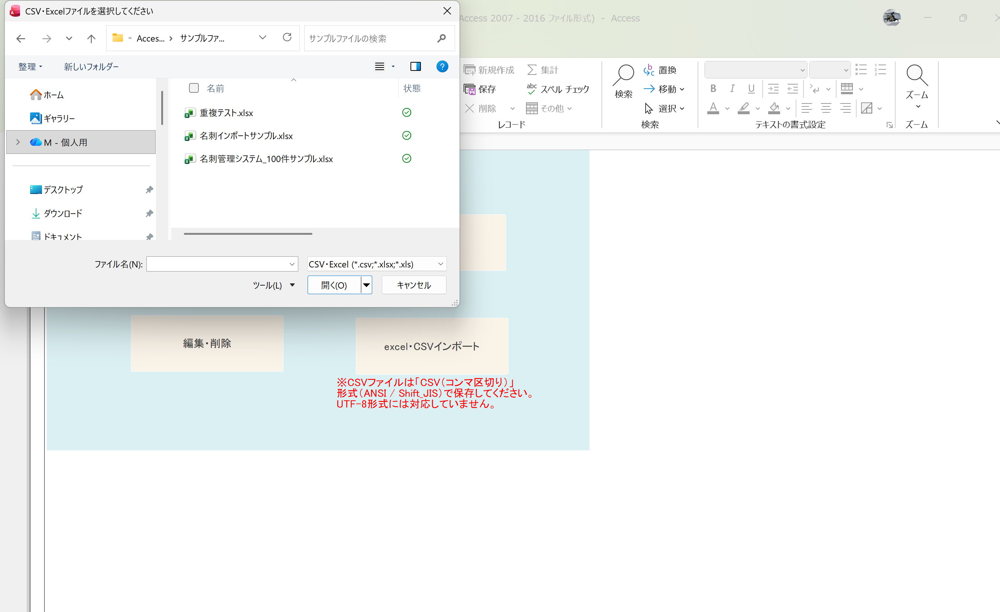
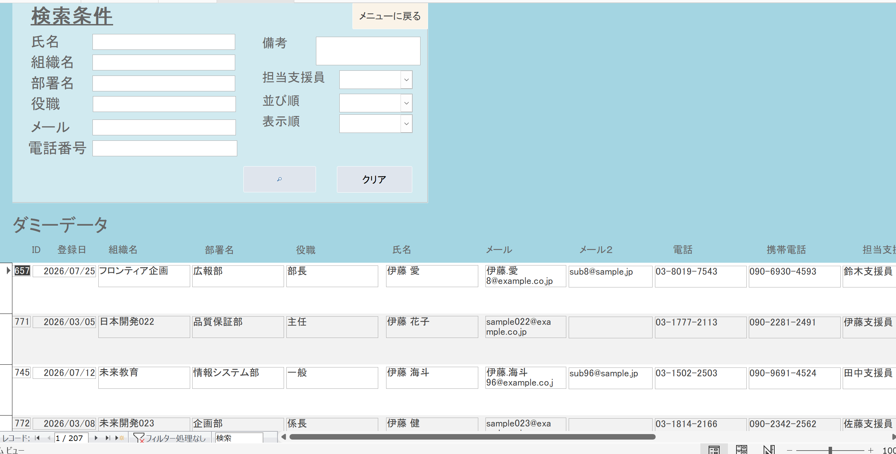
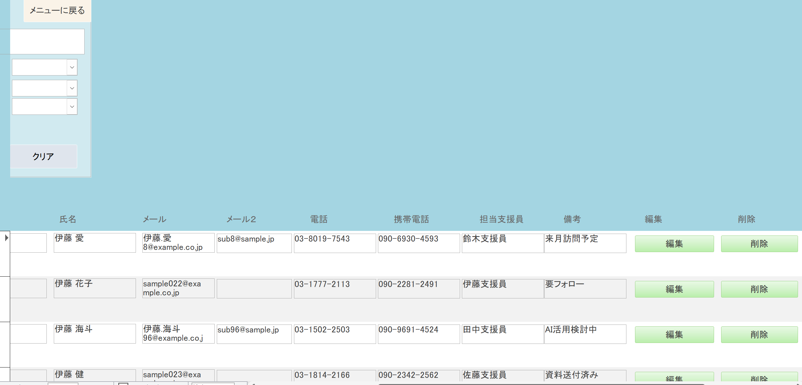

# Access VBA 名刺管理データベース

名刺・連絡先情報の登録、検索、編集・削除、CSV・Excel一括取込、表記揺れを考慮した重複候補の確認を行う、Microsoft Access / VBA製のデータベースアプリケーションです。

## 概要

就労支援の支援員が営業活動で使用する名刺の情報をデータ入力し、連絡先として一元管理するために作成しました。

支援員が必要な連絡先を検索できることに加え、複数の支援員が同じ人物の名刺を持っている場合にも、重複を確認しながら情報を整理できることを目指しています。単なる台帳ではなく、登録・検索・編集から、一括取込・重複確認・担当支援員の統合までを一連の業務フローとして実装しています。

### 支援員との要件確認・調整

**実際に利用する支援員と相談し、システムの要件を決めながら設計・実装を進めました。** 登録・検索に必要な項目について要望を聞き取り、画面の項目構成へ反映しました。

開発中も支援員と認識をすり合わせながら、入力・検索・重複確認などの操作を業務で使うことを意識して調整しました。

## メニュー画面からできること

基本操作は、データベースの **「メニュー画面」** から行います。



| メニュー | 主な操作 |
|---|---|
| 登録 | 名刺情報の入力、必須項目の確認、保存前の重複チェック |
| 検索 | 登録済みの連絡先の検索・絞り込み・並べ替え |
| 編集・削除 | 対象の名刺を検索し、編集フォームを開く、または削除する |
| インポート | CSV・Excelを取り込み、1件ずつ重複判定して登録する |

Accessが入っていないPCで試す場合は、後述の **「実行方法・初回設定（Windows）」** を参照してください。

## 主な機能

### 1. 名刺情報の登録

専用フォームから、次の15項目を登録できます。

| 分類 | 項目 |
|---|---|
| 所属・人物情報 | 組織名、部署名、役職、資格、氏名 |
| 連絡先 | メール、メール2、電話、携帯電話 |
| 管理情報 | 登録日、担当支援員、備考、入力者、確認者、確認日 |

登録フォームでは、組織名・氏名の空欄を確認し、未入力の場合はメッセージを表示して登録を止めます。

氏名は、全角スペースを半角へ置き換え、前後の空白を取り除きます。姓と名の間を半角スペースで区切る入力ルールを案内し、スペースがない場合や連続した半角スペースがある場合は確認を求めます。

保存処理では既存データとの重複を確認し、候補がある場合は確認用フォームへ進みます。

※氏名の入力チェックは登録フォームで行っています。インポート時に同じ入力チェックをすべて適用する実装とは区別しています。



### 2. 名刺情報の検索・絞り込み

複数の検索条件を組み合わせ、必要な連絡先を探せます。通常の検索画面と、編集・削除画面では検索項目が異なります。

| 画面 | 検索項目 |
|---|---|
| 検索 | 氏名、組織名、メール、電話番号、担当支援員 |
| 編集・削除 | 組織名、部署名、役職、氏名、メール、電話番号、担当支援員、備考 |

メールは「メール・メール2」、電話番号は「電話・携帯電話」の両方を対象に検索します。入力した複数条件はAND条件で組み合わせます。

例えば「組織名がグリーンシステムで、担当支援員が佐々木」という条件で対象を絞れます。

氏名・組織名・登録日・担当支援員による昇順／降順の並べ替えと、検索条件をまとめて解除する「クリア」も用意しています。



### 3. 表記揺れを考慮した重複チェック

比較用の組織名・氏名を正規化し、表記の違いを吸収してから重複候補を探します。

組織名からは「株式会社」「有限会社」「合同会社」「合資会社」「合名会社」「（株）」「(株)」「㈱」を除去します。組織名・氏名の両方について、大文字・小文字、空白、ハイフン類、中点、ピリオド、カンマ、括弧などを比較用に整えます。

例えば「株式会社グリーンシステム」と「グリーンシステム」を、法人格の表記だけで別の組織と扱わないための処理です。**比較用の文字列を加工する処理であり、登録済みの組織名を一律に書き換える機能ではありません。**

### 4. 文字列の類似度による候補抽出

レーベンシュタイン距離を使用し、片方の文字列をもう片方へ変えるために必要な文字の挿入・削除・置換の回数から、一致率を計算します。

一方の文字列が他方に含まれる場合の評価も行い、0〜1の範囲で扱います。

例えば「グリーンシステム」と「グリーシステム」のように、完全一致ではない入力も、組織名・氏名の条件を満たせば候補として表示します。類似しているだけで同一人物と確定せず、人が確認するための情報として利用します。

### 5. 組織名と氏名を組み合わせた判定

組織名と氏名をそれぞれ比較し、氏名にやや大きな重みを付けます。

**総合一致率 ＝ 組織名の一致率 × 0.45 ＋ 氏名の一致率 × 0.55**

次のいずれかの条件を満たすレコードを候補として抽出します。

| 条件 | 氏名の一致率 | 組織名の一致率 | 総合一致率 |
|---|---:|---:|---:|
| 1 | 80%以上 | 65%以上 | — |
| 2 | 95%以上 | 45%以上 | — |
| 3 | 65%以上 | 95%以上 | — |
| 4 | 55%以上 | 55%以上 | 72%以上 |

候補は上から順に、組織名・氏名ともに99.9%以上なら「完全一致」、両方90%以上なら「高一致」、総合80%以上なら「類似」、それ以外を「参考候補」と分類します。

※一致率は文字列の類似度を表す計算値です。本人である確率や、検証によって得られた重複検出の正答率ではありません。

### 6. 重複候補を人が確認する仕組み

重複候補フォームの上部には、新しく登録しようとしている組織名・氏名・担当支援員を表示します。

候補一覧には、既存データの組織名・氏名・担当支援員と、組織一致率・氏名一致率・総合一致率・候補区分などを表示するための情報を用意しています。

候補は一時的な「重複候補」テーブルへ格納し、次の判定時に作り直します。**似ているという理由だけで既存レコードを自動削除・上書きしない**設計です。



### 7. 担当支援員の統合

同じ人物の担当支援員が異なる場合は、候補から1件を選び、既存レコードの担当支援員欄へ追加できます。

| 既存の担当支援員 | 追加する担当支援員 | 統合後 |
|---|---|---|
| 佐々木 | 鈴木 | 佐々木,鈴木 |
| 佐々木,鈴木 | 鈴木 | 佐々木,鈴木 |

既存の担当支援員欄は、「、」「／」「/」「・」などの区切りを半角カンマへ統一して確認します。同じ担当者名がある場合は追加しません。

**この「統合」で更新するのは担当支援員です。メール・電話・部署名などを自動で統合する機能ではありません。**

追加する担当支援員は1名ずつを基本とします。現在のコードでは新規側のカンマを除去するため、複数名をまとめて渡した場合の正しい統合は未対応です。

### 8. CSV・Excelからの一括インポート

ファイル選択画面からCSV・Excelを取り込みます。直接すべてを本テーブルへ登録せず、**ファイル → 一時テーブル → 重複判定 → 本テーブル**の順に処理します。

選択できる拡張子は `.csv`・`.xlsx`・`.xls` です。試用には同梱の `.xlsx` サンプルを使用してください。先頭行を項目名として扱うため、列名・列構成はサンプルに合わせます。

Excelの任意の帳票レイアウトや、自由な列マッピングを自動判別する機能ではありません。



### 9. インポートデータを1件ずつ判定

一時テーブルの先頭から順番に処理します。

| 判定 | 処理 |
|---|---|
| 重複なし | 本テーブルへ登録し、一時テーブルから処理済みの行を削除して次へ進む |
| 重複候補あり | 重複候補フォームを開き、利用者の選択を待つ |
| スキップ条件に該当 | 登録せず、その行を一時テーブルから削除して次へ進む |

同じインポートの先行行も、登録後は後続行の比較対象になります。**開始時に本テーブルが空でも、ファイル内に重複・類似データがあれば候補が表示されます。**

### 10. 完全一致判定による自動スキップ

`IsExactDuplicate` では、組織名・氏名が一致する既存レコードを探し、取り込む担当支援員が既存の担当支援員欄にすべて含まれているかを確認します。

例えば、既存が「佐々木,鈴木,山野」、取込側が「佐々木」ならスキップ対象です。取込側に新しい担当者が含まれる場合は、重複候補の確認へ進みます。

ただし、**全15項目を比較する「完全一致」ではありません。** メールや電話だけが変わっていても、この判定ではスキップされる可能性があります。連絡先の変更は編集画面で確認・更新してください。

また、組織名・氏名が一致し、取込側の担当支援員が空欄の場合もスキップ対象です。担当支援員の複数名を一度に統合する処理とは別の判定です。

### 11. インポート途中での「統合・新規登録・キャンセル」

候補が表示されたときは、次の操作を選べます。

| 操作 | 本テーブルへの反映 | インポート中の続き |
|---|---|---|
| 統合 | 選択した既存レコードへ担当支援員を追加 | 対象の一時データを削除して次へ |
| 新規登録 | 別レコードとして登録 | 対象の一時データを削除して次へ |
| キャンセル | 登録・統合しない | その1件をスキップして次へ |

この「キャンセル」は、インポート済みの全件を取り消す操作ではありません。利用者が判断した後、残りの処理をそのまま再開する構成です。

### 12. 編集・削除

編集・削除画面から対象レコードを選び、編集フォームを開きます。編集フォームを閉じた後は一覧を再取得して変更を表示します。

削除時は対象の氏名などと確認メッセージを表示し、利用者が「はい」を選んだ場合に、そのレコードを指定して削除します。削除は取り消せないため、試用時はデータベースのコピーを使用してください。

**検索条件・対象データ一覧（画面左側）**

[](images/編集削除画面.png)

**編集・削除ボタン（画面右側）**

[](images/編集削除画面②.png)

※上の2枚は、画像をクリックして開けます。

## 工夫した点・技術的課題

### 支援員との要件調整を画面へ反映

支援員と登録・検索に必要な項目を確認し、実際にどの情報から連絡先を探すかを考えながら画面を作成しました。名刺を保存するだけでなく、探す・見直す・追加する操作まで含めて設計しています。

### 自動処理と人の判断を分けた

重複のないデータやスキップ条件を満たすデータは順次処理し、類似していて判断が必要なものは確認フォームへ渡します。候補の抽出と、同一人物かどうかの最終判断を分けました。

### 表記の正規化と入力チェック

比較時の会社名・氏名の正規化、登録フォームの必須項目チェック、担当支援員の区切り統一など、文字の表記差による検索・重複判定の扱いを意識しています。

### フォームと共通処理を分離

画面の操作はフォームのイベントで扱い、重複候補作成・類似度計算・担当支援員の統合・レコード登録・インポートの進行は標準モジュールへまとめています。

インポート、候補作成、統合、削除などでは、エラー番号・内容を表示する処理を設け、どの段階で失敗したかを確認できるようにしています。

## データと処理の構成

| 要素 | 役割 |
|---|---|
| ダミーデータ | 公開用データベースで名刺・連絡先を保存する本テーブル |
| 一時テーブル | インポートした未処理データを保持 |
| 重複候補 | 現在処理している名刺に対する既存レコードの候補を保持 |
| フォーム | メニュー、登録、検索、編集・削除、編集、重複候補の確認 |
| 標準モジュール | 類似度計算・重複判定・担当支援員の統合・登録・インポートの共通処理 |

使用技術：Microsoft Access、VBA、Access SQL、DAO、Scripting.Dictionary。

[VBAコードを見る](source/VBAcode.txt)

`VBAcode.txt` はフォームと標準モジュールのコードを閲覧用にまとめたものです。このテキストだけで画面やテーブルを再構築するものではありません。実行には `.accdb` を使用します。

## ファイル構成

```text
access-business-card-management/
├── README.md
├── 名刺DB.accdb
├── images/
│   ├── メニュー画面.png
│   ├── 新規登録画面.png
│   ├── 検索画面.png
│   ├── 重複登録チェック画面.png
│   ├── CSVインポートウィンドウ.png
│   ├── 編集削除画面(1).png
│   └── 編集削除画面②.png
├── source/
│   └── VBAcode.txt
└── サンプルファイル/
    ├── 名刺インポートサンプル.xlsx
    ├── 名刺管理システム_100件サンプル.xlsx
    └── 重複テスト.xlsx
```

## 実行環境

Windows上で、Microsoft Access通常版、またはAccessアプリを実行するためのMicrosoft 365 Access Runtimeを使用します。

**Accessが入っていない場合は、先にAccess Runtimeをインストールしてください。既に通常版Accessが入っている場合は、Runtimeの追加インストールは不要です。** Runtimeは実行用で、フォームやVBAの設計・編集用ではありません。

参考：[Microsoft公式：Access Runtimeのダウンロードとインストール](https://support.microsoft.com/ja-jp/access/download-and-install-microsoft-365-access-runtime) ／ [Accessアプリケーションの配布とRuntimeの制約](https://support.microsoft.com/ja-jp/access/deploy-an-access-application)

※本プロジェクトの動作確認済みAccessバージョン・ビット数・Runtimeでの全機能の確認結果は、現時点でこのREADMEには記載していません。

## 実行方法・初回設定（Windows）

### 1. Access Runtimeをインストールする

Access通常版がある場合は、この手順を省略して「2. ファイルを展開する」へ進んでください。

1. [Microsoft公式のAccess Runtimeダウンロードページ](https://support.microsoft.com/ja-jp/access/download-and-install-microsoft-365-access-runtime)を開きます。
2. 使用する言語を「日本語」にし、32ビット（x86）または64ビット（x64）のインストーラーを選びます。
3. 既にOfficeが入っている場合は、Officeのビット数を確認して合わせます。ExcelまたはWordの **[ファイル] → [アカウント] → [Excelのバージョン情報]／[Wordのバージョン情報]** から確認できます。
4. ダウンロードしたセットアップファイルを実行します。Microsoftの正規インストーラーであることを確認し、端末への変更許可を求められたら [はい] を選びます。
5. 画面の案内に従ってインストールを完了します。

Windowsが64ビットだからという理由だけでRuntimeも64ビットにせず、既存Officeの構成を確認してください。OfficeがないPCでは、Microsoft公式ページのビット数選択の案内に従います。

既存Officeのバージョンやインストール方式によっては併用制限があります。特にWindows Installer（MSI）版Officeとの互換性制限があります。導入時にエラーが出た場合は、既存Officeを安易に削除せず、PC管理者へ確認してください。

参考：[Officeのバージョン・ビット数の確認](https://support.microsoft.com/ja-jp/office/lifecycle/lc-account/about-office-what-version-of-office-am-i-using) ／ [32ビット／64ビット版Officeの選択](https://support.microsoft.com/ja-JP/Office/lifecycle/officeinstall/choose-between-the-64-bit-or-32-bit-version-of-office)

### 2. ファイルを展開する

リポジトリ全体をダウンロードし、ZIPの場合はエクスプローラーの **[すべて展開]** で展開します。ZIP内から直接 `.accdb` を開かず、書き込み可能な専用フォルダーへ保存してください。

保存先の例：`C:\Users\ユーザー名\Documents\Access名刺管理`

ここで示すパスは例です。実際に保存したフォルダーを使用してください。試用前に、`名刺DB.accdb` のコピーを保管します。

### 3. ファイルのプロパティでブロックを解除する

インターネットから取得したファイルは、Windowsの情報に基づいてOffice側でアクティブコンテンツの実行が制限される場合があります。配布元と内容を確認し、信頼できるファイルだけを対象に操作してください。

1. Accessを閉じます。
2. エクスプローラーで、展開した **`名刺DB.accdb`** を右クリックします。
3. **[プロパティ] → [全般]** を開きます。
4. 下部の **[セキュリティ]** に **[許可する]** が表示されている場合は、チェックを入れます。Microsoftの案内では **[ブロック解除]（Unblock）** と表記される操作です。
5. **[適用] → [OK]** を押します。
6. データベースを開き直します。

この項目が表示されない場合は、そのファイルではこの操作を行えません。ファイル単位のブロック解除と、Access側の信頼設定は別のため、警告が続く場合は次の項目を確認します。

参考：[Microsoft公式：信頼できるファイルのマクロを実行するためのブロック解除](https://learn.microsoft.com/ja-jp/microsoft-365-apps/security/internet-macros-blocked)

### 4. アクティブコンテンツがブロックされる場合

次の警告が出る場合は、Access側の信頼設定を確認します。

> このファイル内のアクティブなコンテンツはブロックされています。トラスト センターの設定を確認するか、IT 管理者にお問い合わせください。

これはデータベースを開くパスワードとは別の、VBA・マクロなどの実行許可に関する警告です。

#### 通常版Accessで「信頼できる場所」を設定する

1. Accessの **[ファイル] → [オプション]** を開きます。
2. **[トラストセンター] → [トラストセンターの設定]** を開きます。バージョンによっては「セキュリティセンター」と表示されます。
3. **[信頼できる場所] → [新しい場所の追加]** を選びます。
4. [参照] から、`名刺DB.accdb` を置いた専用フォルダーを指定します。
5. このDBをフォルダー直下で使う場合、サブフォルダーまで信頼する設定は不要です。
6. [OK] で保存し、データベースを閉じて開き直します。

指定するのは、**Accessファイルそのものではなく、そのファイルを保存したフォルダー**です。ドライブ全体やダウンロードフォルダー全体を信頼する設定にはしないでください。

参考：[Microsoft公式：Accessデータベースを信頼する方法](https://support.microsoft.com/ja-jp/access/decide-whether-to-trust-a-database) ／ [Officeの信頼できる場所の注意点](https://learn.microsoft.com/ja-jp/microsoft-365-apps/security/trusted-locations)

#### Runtimeのみの環境で設定画面が出ない場合

上の操作は、通常版Accessの設定画面を利用する手順です。**Runtimeで [ファイル] → [オプション] が使えない場合、この手順をそのまま実行することはできません。**

ファイルのブロック解除後も利用できない場合は、この専用フォルダーをAccessの信頼できる場所として設定できるか、PC管理者または配布元へ確認してください。組織のセキュリティ設定で禁止されている場合は、管理者の指示に従います。

**[すべてのマクロを有効にする] を一律に設定する必要はありません。また、Excelの「VBAプロジェクト オブジェクト モデルへのアクセス」を許可する操作と、このAccessファイルの信頼設定は別です。** 本ツールのためにExcel側の設定を変更する手順は設けていません。

### 5. パスワードを入力し、メニュー画面から操作する

1. 展開した **`名刺DB.accdb`** を開きます。
2. データベースのパスワードを求められたら、次を入力します。

```text
mA1!lnGzfrlz
```

3. **「メニュー画面」** から「登録」「検索」「編集・削除」「インポート」を選択します。

このパスワードは、公開用データベースを開くためのものです。編集・削除の管理者認証とは別です。公開版では、利用者別の認証・権限管理を実装対象外としています。

<details>
<summary>メニュー画面が出ない場合・配布前の確認</summary>

通常版Accessでは、ナビゲーションウィンドウから「メニュー画面」を開いて確認できます。

起動時の表示設定を行う場合は、通常版Accessで **[ファイル] → [オプション] → [現在のデータベース] → [表示フォーム]** に「メニュー画面」を指定し、保存して開き直します。

Runtimeではナビゲーションウィンドウが使えないため、配布者側で、起動時にメニューが表示されることを確認する必要があります。ブロック解除だけで解決しない場合は、起動設定も確認してください。

起動時の表示設定はデータベース側の設定であり、添付のVBAテキストだけでは設定済みかどうかを判断できません。

参考：[Microsoft公式：起動時に表示するフォームの設定](https://support.microsoft.com/ja-jp/access/set-the-default-form-that-appears-when-you-open-an-access-database) ／ [Runtimeで使用できない機能](https://support.microsoft.com/ja-jp/access/deploy-an-access-application)

</details>

## サンプルを使った操作確認

試用には実在の名刺情報ではなく、同梱のサンプルを使用してください。操作によってデータベース内の情報が変更されます。

| サンプル | 確認する内容 |
|---|---|
| 名刺インポートサンプル.xlsx | 入力項目・形式と、基本的な取込操作 |
| 名刺管理システム_100件サンプル.xlsx | 複数件を順次取り込む操作と、検索・並べ替え |
| 重複テスト.xlsx | 対応する既存データに対する、重複候補の表示・担当支援員の統合 |

重複テストは、**比較対象となる組織名・氏名のレコードが、現在のDBに登録されていること**が前提です。元データと異なる版の100件サンプルを使った場合は、5件すべてが想定どおりの候補になるとは限りません。

一度取り込んだデータは次回の比較対象になります。取込前後の件数、候補に表示された内容、選択した操作の結果を確認してください。

## 既知の制約・注意事項

- 本リポジトリは採用活動用のポートフォリオです。公開するDB・サンプルには実在の個人情報や事業所の機密情報を含めないでください。
- 公開用の起動パスワードを掲載しているため、このパスワードを機密情報のアクセス制御として扱わないでください。他用途にも使い回さないでください。
- 管理者だけに編集・削除を許可する認証機能は、公開版では対象外です。
- 通常の検索画面の担当支援員条件は完全一致、編集・削除画面では部分一致です。担当支援員欄に複数名が入っている場合は、検索画面によって結果が異なります。
- 自動スキップは組織名・氏名・担当支援員を基準とし、全項目の変更を検知するものではありません。担当支援員の複数名一括統合も未対応です。
- 「入力者・確認者・確認日」は記録項目です。別の人によるダブルチェックをシステムで強制する機能ではありません。
- インポートは1件ずつ確定するため、途中で中断しても、それ以前に登録・統合したデータは自動的に元へ戻りません。再開・再実行前に登録状況を確認してください。
- 一時テーブルと重複候補テーブルは処理時に初期化するため、同じデータベースで複数人が同時にインポート・重複確認を行う運用は避けてください。
- 類似度は確認候補を出すための目安です。会社名の類似や同姓同名による誤統合を避けるため、統合前に内容を確認してください。
- 実行環境による差があるため、Runtimeだけを導入したPCでも、起動・各メニュー・インポートが動くかを確認してください。

---

機能説明は公開用VBAコードの実装範囲を基準としています。Runtimeのインストール・WindowsとAccessの信頼設定は、本文中のMicrosoft公式案内を参照しています。
